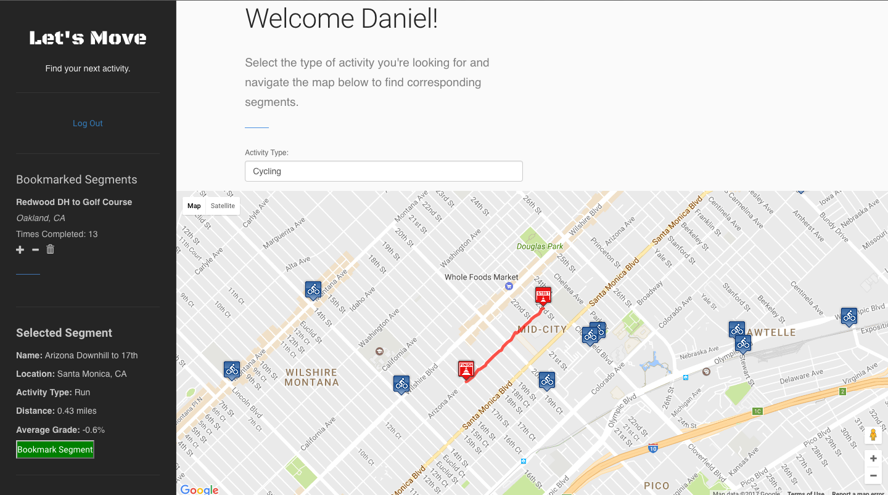
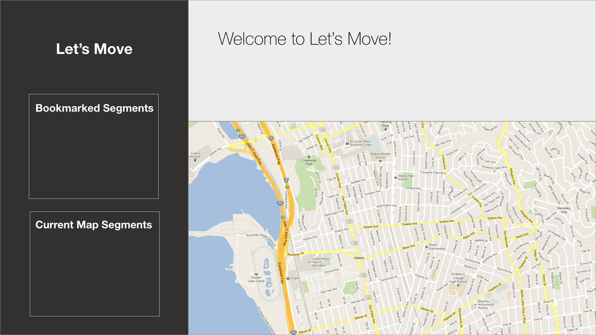
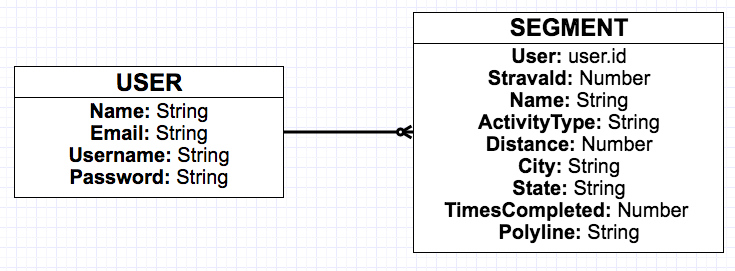

# **Let's Move**

A web application created for users to view popular running and cycling segments from any location in the world!

## Overview:

**Let's Move** is a web application designed for users that are looking for popular running and cycling routes. My main goal with this project was to become more familiar with the React framework. I also wanted to gain more practice implementing multiple APIs for a web application, which is why I decided to include both the Google Maps and Strava APIs.

The application's design was based on the user interface and functionality from both the Strava and Airbnb applications. I wanted to create an application where anybody could go to get ideas for their next run or bike ride. I think this is extremely useful for people that are visiting a new location and are wanting to know where the popular running and cycling routes are located. In addition, I really wanted to experiment with the Google Maps API and become more familiar with it and learn how to integrate its key features into a web application.

The application's key functionality is to allow users to pan across a map generated from the Google Maps API. As the user explores the map, markers will appear that correspond to either running or cycling routes (depending on what the user sets the filter) that are located within the map's boundaries. These routes (segments) are being retrieved from the Strava API and generated onto the map with a marker at the starting position. Clicking on a segment will retrieve additional data on that segment, as well as produce a polyline on the map to visually display the route along with its starting and ending points.

(Link to <a href="https://trello.com/b/PNYmw6me/to-dos">Trello Board</a> for additional documentation.)

## Using The App:

### For Developers:
- For the API / server application, fork from the repo on <a href="https://github.com/dmacauyag/WDI-45-Project_4-Server_App">GitHub</a>
	- Run `mongod` to start the MongoDB.
	- Run `npm install` to load the dependencies for the server app.
- For the client application, fork from the repo on <a href="https://github.com/dmacauyag/WDI-45-Project_4-Client_App">GitHub</a>
	- Run `npm install` to load the dependencies for the client app.
	- Run `npm start` to start the development server.

### For Regular Users:
- Click on <a href="https://wdi45-letsmove.herokuapp.com/">Let's Move</a> to visit the application.
- Create a new account in order to access full functionality.
- Under the "Activity Type" selector, choose what type of activity you want to see appear as you navigate the map.
- Simply click on the map and drag to navigate. As you zoom in/out and change the position of the map, new markers will appear corresponding to a segment.
- The segments that are currently shown on the map are also listed on the sidebar.
- To view additional information on a segment as well as a line to display the route on the map, simply click on a segment from the list in the sidebar or a marker on the map.
- If the selected segment is not already bookmarked, a button will appear with the option to bookmark the segment.
- All bookmarked segments are listed on the sidebar. Clicking on a bookmarked segment will bring up additional information.
- Bookmarks can be deleted by clicking on the trash can icon. Clicking on the plus and minus icons edits the bookmarks so users can keep track of how many times they have completed a segment.

## Development and Technologies:

**Let's Move** is built on the MERN Stack using:

- HTML5 / CSS3
- JavaScript
- Bootstrap CSS framework
- MongoDB
- Express Framework (back-end)
- React Framework (front-end)
- Node.js

In addition:

- The <a href="https://developers.google.com/maps/documentation/javascript/">Google Maps Javascript API</a> was utilized with the help of the <a href="https://www.npmjs.com/package/react-google-maps">react-google-maps</a> npm package.
- The <a href="https://strava.github.io/api/">Strava V3 API</a> was utilized with the help of the <a href="https://www.npmjs.com/package/strava-v3">strava-v3</a> npm package.

## User Stories:
- As a user, I want a way to view popular running and cycling routes by location.
- As a user, I want to be able to save my favorite running and cycling routes so I can keep track of and view them whenever I login to the application.
- As a user, I want a user interface that is simple and easy to navigate.
- As a user, when I select a running or cycling segment, I want to visually see the route on the map as well as markers to highlight for where the segment begins and ends.

## Wireframe:

## ERD Diagram:

## MVP:
- Implement two models: users and segments.
- Include basic sign up / log in functionality with encrypted passwords as well as validation to check for duplicate usernames and email addresses.
- Require user authentication for API routes.
- Users can save running and/or cycling segments.
- Utilize the Google Maps API to generate map markers and polylines.
- Utilize the Strava API in order to load running and cycling segments on the Google Map.
- Create a user interface that is simple and easy to navigate.

## Future Features:
- Allow users to post comments for a segment that can be viewed by other users of the application. 

## Credit and Acknowledgements:
- The custom map marker icons were from <a href="https://mapicons.mapsmarker.com/">Map Icons Collection</a>.
- The following <a href="https://www.youtube.com/watch?v=jZZEskrwc4w&list=PL9ygKXBeXkWyQI9g3CsNKLjRX-5WoRXgf&index=2&t=250s">video tutorial</a> from **velocity360**  was used to help setup the Google Map.
- The polyline decoder function was taken from **GitHub**: <a href="https://gist.github.com/ismaels/6636986">https://gist.github.com/ismaels/6636986</a>
- Thanks to instructors **Philippe Luchansky** and **Jimmy Garzon** of **General Assembly Santa Monica** for all their help with the project.
